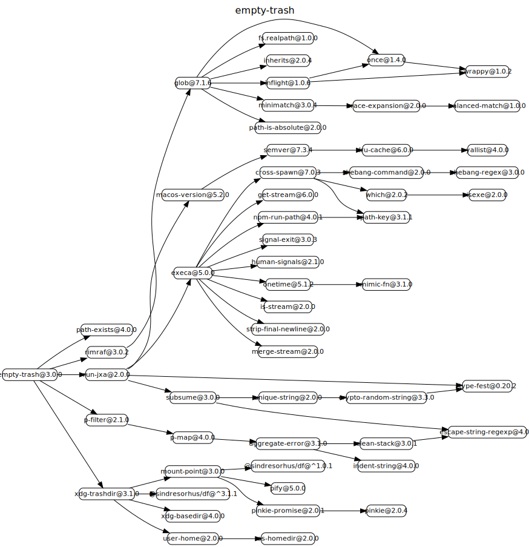

# 源码分析

## 文件结构

``` bash
/Users/liufang/openSource/FunnyLiu/empty-trash
├── index.d.ts
├── index.js
├── index.test-d.ts
├── lib
|  └── empty-recycle-bin.exe
├── license
├── package.json
├── readme.md
└── test.js

directory: 1 file: 8

ignored

```

## 外部模块依赖



## 内部模块依赖


  