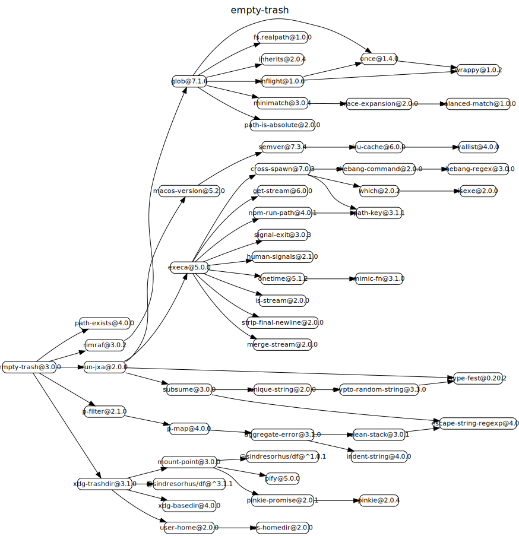

# 源码分析

## 文件结构

``` bash
/Users/liufang/openSource/FunnyLiu/empty-trash
├── index.d.ts
├── index.js
├── index.test-d.ts
├── lib
|  └── empty-recycle-bin.exe
├── license
├── package.json
├── readme.md
└── test.js

directory: 1 file: 8

ignored

```

## 外部模块依赖



## 内部模块依赖


  


# empty-trash

> Empty the [trash](https://en.wikipedia.org/wiki/Trash_(computing))

Works on macOS, Linux, and Windows.

## Install

```
$ npm install empty-trash
```

## Usage

```js
const emptyTrash = require('empty-trash');

(async () => {
	await emptyTrash();
})();
```

## Info

On macOS, AppleScript is used as it's the only way to do it without incurring permission issues.

On Linux, the [XDG spec](https://specifications.freedesktop.org/trash-spec/trashspec-1.0.html) is followed.

On Windows, [`empty-recycle-bin`](https://github.com/sindresorhus/empty-recycle-bin) is used.

## Related

- [empty-trash-cli](https://github.com/sindresorhus/empty-trash-cli) - CLI for this module
- [trash](https://github.com/sindresorhus/trash) - Move files and folders to the trash
